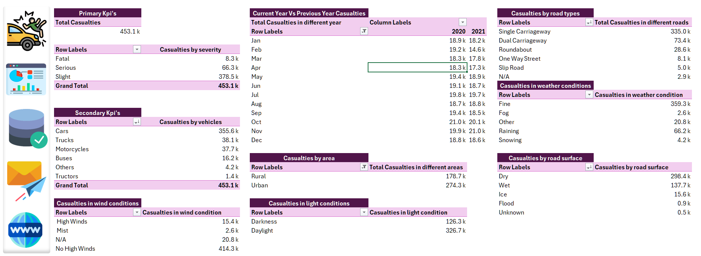
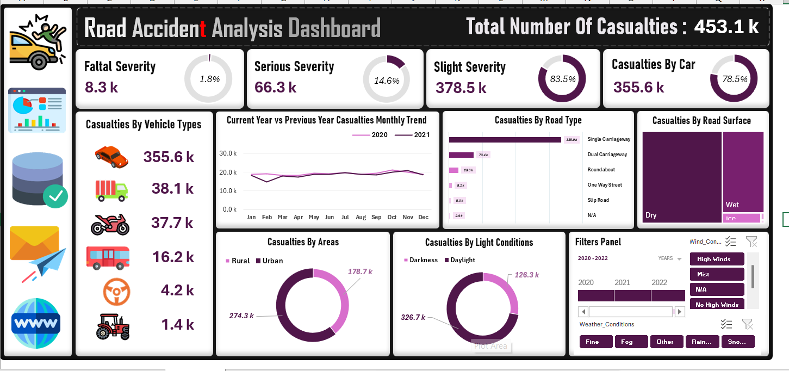

# 🚗 Road Accident Analysis Dashboard (Excel)

**Dataset:** 2020–2021  
**Records analyzed:** 300,000+ road accident records

---

## ⭐ Situation  
A large, unstructured accident dataset (2020–2021) made it difficult to quickly understand severity levels, patterns, and high-risk factors.

## 🎯 Task  
Analyze over 3 lakh accident records and build an interactive Excel dashboard highlighting:
- Accident severity  
- Vehicle types  
- Environmental and road conditions  
- Area-wise split (Rural vs Urban)  
- Year-over-Year monthly trends  

## ⚙️ Action  
Using Microsoft Excel (Power Query, Pivot Tables, Pivot Charts, Slicers):
- Cleaned and transformed ~300k records  
- Built KPI visuals (doughnut charts, bar charts, line charts)  
- Added slicers for Year, Area, Vehicle Type, Weather  
- Designed an interactive, easy-to-understand dashboard  

## 📊 Result  
- **Total Casualties:** 453.1k  
- **Fatal:** 8.3k | **Serious:** 66.3k | **Slight:** 378.5k  
- **Top Vehicle:** Cars — 355.6k casualties  
- **Area Split:** Urban 274.3k | Rural 178.7k  
- **Environmental Insights:**  
  - Fine weather & Dry roads had the highest casualties  
- **Trend:** Full 2020 vs 2021 Monthly YoY comparison  

---

# 📌 Project Insights

### 🚗 Casualties by Vehicle Types
- Cars: 355.6k  
- Trucks: 38.1k  
- Motorcycles: 37.7k  
- Buses: 16.2k  
- Others: 4.2k  
- Tractors: 1.4k  

### 🌍 Casualties by Area
- Urban: 274.3k  
- Rural: 178.7k  

### 🌦 Environmental Conditions  
- **Weather:** Fine (359.3k), Raining (66.2k), Fog (2.6k), Snow (4.2k)  
- **Road Surface:** Dry (298.4k), Wet (137.7k), Ice (15.6k)  
- **Light:** Daylight (326.7k), Darkness (126.3k)  

---

# 🛠 Tools Used
- Microsoft Excel  
- Power Query  
- Pivot Tables & Pivot Charts  
- Slicers & Filters  
- Custom KPI formatting  

---

# 🖼 Dashboard Preview

### KPI View  

### Full Dashboard  

---

# 🙌 Author
**Subham – Aspiring Data Analyst**

If you found this helpful, please ⭐ star the repository!
